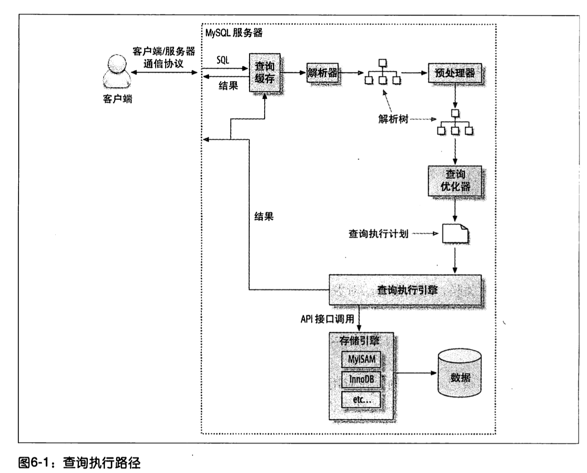

# 6 查询性能优化
查询优化，索引优化，库表结构优化需要齐头并进。查询的生命周期大致可以按照顺序来看：从客户的，到服务器，然后在服务器上进行解析，生成执行计划，执行，并返回结果给客户端。

其中“执行”可以认为是整个生命周期中最重要的阶段，这其中包括了大量为了检索数据到存储引擎的调用以及调用后的数据处理，包括排序、分组等。

## 6.2 慢查询基础：优化数据访问
1. 是否像数据库请求了不需要的数据
2. MySQL是否在扫描额外的记录。最简单的衡量查询开销的三个指标，**响应时间**，**扫描的行数和访问类型**和**返回的行数**。如果发现查询需要扫描大量的数据但只返回少数的行，那么通常可以尝试下面的技巧去优化它：
   - 使用索引覆盖扫描，把所有需要用的列都放到索引中
   - 改变库表结构
   - 重写这个复杂的查询

## 6.3 重构查询的方式
### 6.3.2 切分查询
有时候对于一个大查询需要“分而治之”，将大查询切分成小查询。比如删除大量数据时，如果用一个大的语句一次性完成的话，则可能需要一次锁住很多的数据，占满整个事务日志、耗尽系统资源、阻塞很多小的但重要的查询。如：
```sql
DELETE FROM messages WHERE created < DATE_SUB(NOW(), INTERVAL 3 MONTH);
```
可以优化为：
```
rows_affected = 0
do {
    rows_affeced = do_query(
        "DELETE FROM messages WHERE created < DATE_SUB(NOW(), INTERVAL 3 MONTH) LIMIT 10000"
    )
} while rows_affected > 0
```

### 6.3.3 分解关联查询
例子：
```sql
SELECT * FROM tag
    JOIN tag_post ON tag_post.tag_id = tag.id
    JOIN post ON tag_post.post_id = post.id
WHERE tag.tag = 'mysql';
```
可以分解为下面的查询语句：
```sql
SELECT * FROM tag WHERE tag='mysql';
SELECT * FROM tag_post WHERE tag_id = 1234;
SELECT * FROM post WHERE post_id in (123,455,678,2344,5566);
```
分解后的重构有如下优势：
- 让缓存的效率更高。应用程序可以方便的缓存单表的查询结果对象
- 执行单个查询可以减少锁的竞争
- 在应用层做关联，可以更容易对数据库进行拆分，更容易做到高性能和可扩展
- 查询本剩效率也可能会有所提升。用`IN()`代替关联查询，可以让MySQL按ID顺序查询，这可能比随机的关联查询更高效
- 可以减少冗余查询记录
- 在应用中实现了哈希关联，而不是使用MySQL的嵌套循环关联

## 6.4 查询执行的基础
根据下图，可以看到向MySQL发送一个请求的时候，MySQL到底做了什么。



1. 客户端发送一条查询给服务器
2. 服务器先检查查询缓存，如果命中了缓存，则立即返回存储在缓存中的结果。否则进入下一阶段
3. 服务器进行SQL解析，预处理，再由优化器生成对应的执行计划
4. MySQL根绝优化器生成的执行计划，调用存储引擎的API来执行查询
5. 将结果返回给客户端

### 6.4.1 MySQL客户端/服务器通信协议
MySQL客户端和服务器之间的通信协议是“半双工”的，这意味着，在任何一个时刻，要么是由服务器向客户端发送数据，要么是客户端向服务器发送数据，这两个动作不能同时发生。

客户端用**一个单独的数据包**将查询传给服务器（最大的可以传输的包的大小为`max_allowed_packet`）。而服务器响应给用户的数据通常可以由多个数据包组成，客户端必须完整的接受整个返回结果。MySQL通常需要等所有的数据都已经发送给客户端才能释放这条查询所占用的资源，所以接受全部结果并缓存通常可以减少服务器的压力。让查询早点结束，释放响应的资源。 

**查询状态**
```
mysql> SHOW FULL PROCESSLIST;
+----+------+-----------+------+---------+------+----------+-----------------------+
| Id | User | Host      | db   | Command | Time | State    | Info                  |
+----+------+-----------+------+---------+------+----------+-----------------------+
|  3 | root | localhost | NULL | Query   |    0 | starting | SHOW FULL PROCESSLIST |
+----+------+-----------+------+---------+------+----------+-----------------------+
1 row in set (0.00 sec)
```

### 6.4.2 查询缓存
通过查询缓存是打开的，解析查询语句前会查询是否命中查询缓存中的结果，这个检查是通过一个对大小写敏感的哈希查找实现的。

### 6.4.3 查询优化处理
- 语法解析器和预处理
- 查询优化器
- 查询和索引的统计信息
- 执行关联查询（MySQL关联执行的策略：对任何关联都执行嵌套循环关联操作，即先在一个表中循环取出单条数据，然后再嵌套循环到下一个表中寻找匹配的行，依次下去，直到找到所有表中匹配的行为止。然后根据各个表匹配的行，返回查询中所需要的各个列。）
- 执行计划
- ...

### 6.7.2 优化关联查询
- 确保在`ON`或者`USING`子句中的列由索引。一般来说，除非有其他理由，否则只需在关联顺序中的第二个表的相应列上创建索引
- 确保任何的`GROUP BY` 和`ORDER BY`中的表达式只涉及到一个表中的列，这样MySQL才有可能使用索引来优化这个过程

### 6.7.4 优化`GROUP BY` 和`ORDER BY`
在MySQL中，当无法使用索引的时候，`GROUP BY`使用两种策略来完成：使用临时表或者文件（内存或者磁盘文件）来排序。

如果需要对关联查询做分组，并且是按照查找表中的某个列进行分组，那么通常采用查找表的标示列分组的效率会比其他列更高。如：
```SQL
# 效率不会很好
SELECT actor.first_name, actor.last_name COUNT(*)
FROM film_actor
    INNER JOIN actor USING(actor_id)
GROUP BY actor.first_name, actor.last_name;

# 效率更高
SELECT actor.first_name, actor.last_name COUNT(*)
FROM film_actor
    INNER JOIN actor USING(actor_id)
GROUP BY actor_id
```

### 6.7.5 优化`LIMIT`分页
1. 如果有对应的索引，使用`LIMIT`并且配合`GROUP BY`通常效率不会低。

2. 优化偏移量非常大的分页查询最简单的办法就是尽量使用索引覆盖扫描，而不是查询所有的列。根据需要做一次关联操作再返回所需的列。对于偏移量很大的时候，这样做的效率会提升非常大。如下面的查询：
```sql
SELECT film_id, description FROM sakila.film ORDER BY title LIMIT 50000,5;
```

如果表非常大，这个查询最好改写成下面的查询：
```sql
SELECT film.film_id, film.description
FROM sakila.film
    INNER JOIN(
        SELECT film_id FROM sakila.film
        ORDER BY title limit 50000, 5
    ) AS lim USING(film_id);
```
这里的“延迟关联”将大大提升查询效率，它让MySQL扫描尽可能少的页面，获取所需访问的记录后再根据关联列回原表查询所需的所有列。

3. 将LIMIT查询转换成已知位置的查询，让MySQL通过范围扫描获取得对应的结果。
4. 其他优化办法还包括使用预先计算的汇总表，或者关联到一个冗余表，冗余表只包含主键列和需要做排序的数据列。


