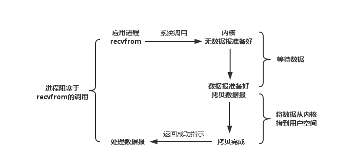
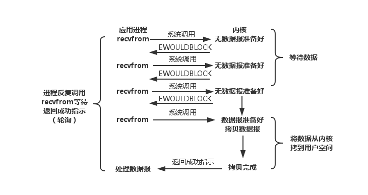
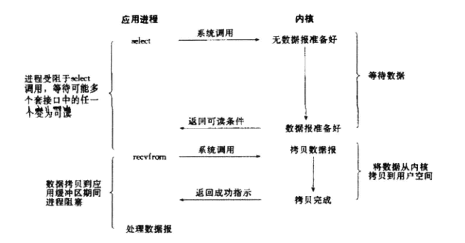
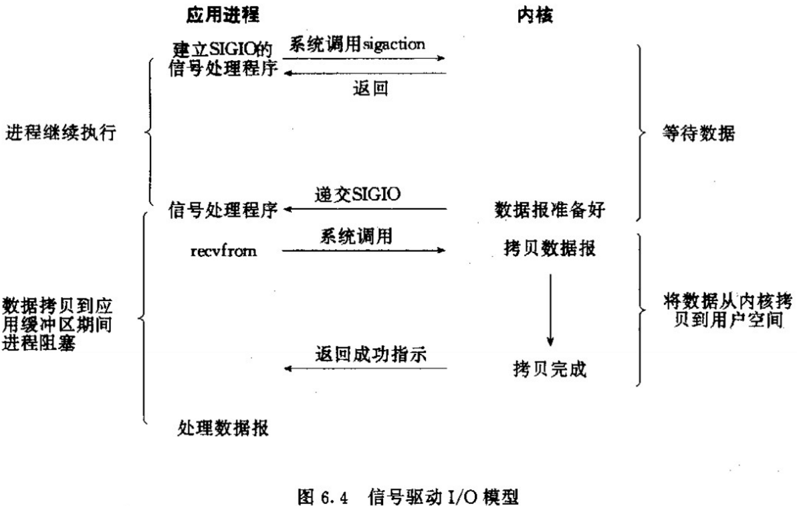
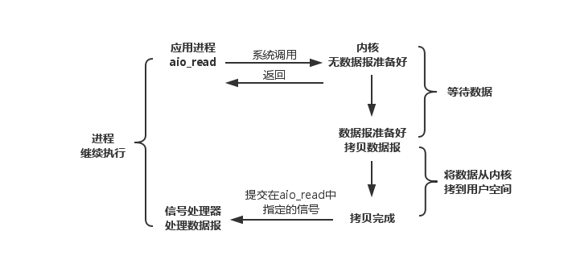

# I/O 复用
## Unix下 I/O 模型
Unix下可用的I/O模型有五种：阻塞式I/O、非阻塞式I/O、I/O复用、信号驱动式I/O和异步I/O。

一个输入操作通常包括两个不同的阶段：
- 等待数据准备好
- 从内核向进程复制数据。

对于一个套接字上的输入操作，第一步通常涉及等待数据从网络中到达，当所等待的分组达到时，它被复制到内核中的某个缓冲区，第二步就是从内核缓冲区复制数据到应用的进程缓冲区。
### 阻塞式I/O（blocking I/O）模型
进程会一直阻塞，直到数据拷贝完成。默认情况下，所有的套接字都是阻塞的。


### 非阻塞式I/O（nonblocking I/O）模型
将套接字设置为非阻塞就是告诉内核，当所请求的I/O操作非得把本进程投入睡眠才能完成时，不要把本进程投入睡眠，而是返回一个错误。这样做往往会耗费大量的CPU时间。


### I/O 复用（ I/O multiplexing）模型
有了 I/O 复用我们就可以调用`select`或者`poll`，阻塞在这两个系统调用中的某一个，而不是阻塞在真正的 I/O 系统调用上。使用这两个系统调用的优势在于我们可以同时等待多个描述符就绪。


### 信号驱动式I/O （signal-driven I/O）模型
让内核在描述符就绪时发送`SIGIO`信号通知我们。

我们首先开启套接字的信号驱动式 I/O 功能，通过`sigaction`系统调用安装一个信号处理函数。该系统调用将立即返回，我们的进程继续工作（没有被阻塞）。当数据报准备好读取时，内核就为该进程长生一个`SIGIO`信号。我们随后可以在信号处理函数中调用`recvfrom`读取数据报，并通知主循环数据已经准备好待处理，也可以立即通知主循环，让它读取数据报。



这种模型的优势在于等待数据报到达期间进程不被阻塞。主循环可以继续执行，只要等待来自信号处理函数的通知：既可以是数据已准备好被处理，也可以是数据报已准备好被去读。

信号驱动式 I/O 阻塞在将数据从内核拷贝到用户空间。

### 异步 I/O （asynchronous I/O）模型
异步 I/O 让内核在整个操作（包括将数据从内核复制到我们的自己的缓冲区）完成后通知我们。这和信号驱动式 I/O 的区别在于：信号驱动式 I/O 是由内核通知我们合适可以启动一个 I/O 操作，而异步 I/O 模型是由内核通知我们 I/O 操作何时完成。



我们调用`aio_write`函数（POSIX异步 I/O 函数以aio_或者lia_开头），给内核传递描述符、缓冲区指针和文件偏移量，并告诉内核当整个操作完成时如何通知我们。该系统调用立即返回，并且在等待 I/O 完成期间，我们的进程不会被阻塞。

:::tip 同步和异步 I/O 
- 同步 I/O 操作导致请求进程阻塞，直到 I/O 操作完成。
- 异步 I/O 操作不导致请求进程阻塞。
:::

## select函数
该函数允许进程指示内核等待多个时间中的任何一个发生，并只有在一个或者多个事件发生或经历一段时间后才唤醒它。
```c
#include <sys/select.h>
#include <sys/time.h>
int select(int maxfdpl, fd_set *readset, fd_set *writeset,fd_set *exceptset, const struct timeval *timeout);
/* 返回：若有就绪描述符则返回其数目，超时则返回 0，若出错则返回 -1 */
```
参数`timeout`，告诉内核等待所指定描述符中任何一个就绪可花多长时间。 `timeval`结构如下：
```c
struct timeval {
    long tv_sec;    /* 秒 */
    long tv_usec;   /* 微秒 */
}
```
这个参数有三种可能：
1. 永远等待下去，设置该参数为空指针；
2. 等待一段固定的时间，在有一个描述符准备好后就返回，但是不超过该参数所制定的时间；
3. 根本不等待。检查描述符后立即返回，这称为`轮询(polling)`。为此参数必须指定一个timeval结构并且设置秒和微秒都为0。

中间的三个参数`readset`，`writeset`，`exceptset`指定我们要让内核测试读、写和一长条件的描述符。目前支持的异常条件有：
1. 某个套接字的外带数据的到达
2. 某个已置为分组模式的伪终端存在可从其主端读取的控制状态信息。

select使用`描述符集`来作为这三个数据的类型，它通常是一个整数数组，并且数组中每一位对应一个描述符。其实现细节隐藏在名为`fd_set`的数据类型和以下四个宏中：

```c
void FD_ZERO(fd_set *fdset);            /* 清空fdset中所有位 */
void FD_SET(int fd, fd_set *fdset);     /* 在fdset中为fd开启相应的位 */
void FD_CLR(int fd, fd_set *fdset);     /* 在fdset中为fd关闭相应的位 */
void FD_ISSET(int fd, fd_set *fdset);   /* 在fdset中fd相应的位已开启？ */
```

如果我们对这三个参数中某些不感兴趣，我们可以将其设置为空指针。

`maxfdpl` 参数指定待测试的描述符的个数，它的值是待测试的最大描述符加1，描述符0，1，2，……，maxfdpl - 1均将被测试。存在这个参数以及计算其值得额外负担存粹是为了效率原因。每个fd_set都有表示大量描述符（通常数量为1024）的空间，然而一个普通的进程所用的数目却很少，在进程和内核之间，内核通过不复制描述符集中不必要的部分，从而不测试总为0的那些位来提升效率。

这三个参数是值-结果参数，select函数会修改这三个参数所指向的描述符集。描述符集内任何与未就绪描述符对应的位返回时均清为0，因此每次重新调用select函数时都得再次把所有描述符集内所关心的位设置1。

:::danger 提示
select编程的两个常见的错误：
1. 忘了对最大描述符加 1
2. 忘了描述符集是值-结果参数
:::

### 描述符就绪的条件
#### 可读条件（满足一条即可）
1. 该套接字的接受缓冲区中的数据字节数大于或等于接受缓冲区低水位值。我们可以使用`SO_RCVLOWAT`套接字选项来设置该套接字的低水位标记。对于TCP和UDP而言，其默认值是1。
2. 该套接字的读半部关闭（也就是接收了`FIN`的TCP连接）。
3. 该套接字是一个监听套接字，并且已完成的连接数不为0。
4. 其上有一个套接字错误待处理。可以指定套接字选项 `SO_ERROR` 通过调用 `getsockopt` 获取并清除。

#### 可写条件（满足一条即可）
1. 该套接字发送缓冲区中的可用空间字节数大于等于套接字发送缓冲区低水位标记的当前大小，并且该套接字已连接或者不需要连接（如UDP套接字）。可以使用`SO_SNDLOWAT`套接字选项设定低水位标记。
2. 该连接写半部关闭。
3. 使用非阻塞式connect的套接字已连接或者connect已经以失败告终。
3. 其中有一个套接字错误待处理。

#### 异常条件
如果一个套接字存在外带数据或者仍处于带外标记。

:::tip 注意
当某个套接字上发生错误时，它将由select标记为既可读由可写。
:::

### select的最大描述符数
在许多操作系统中的实现有类似于下面的声明
```c
#ifndef FD_SETSIZE
#define FD_SETSIZE  256
#endif
```

如果想调整select的最大描述符数大大小，仅仅修改该头文件是不够的，还必须重新编译内核。

### 用select函数优化客户端代码
我们重写前面的示例，之前客户端可能阻塞于fgets调用，这里我们改为select调用，等待标准输入可读或者套接字可读。
```c
/* file: src/select/unp.h*/

#define min(a, b) ((a) < (b) ? (a) : (b))
#define max(a, b) ((a) > (b) ? (a) : (b))

void str_cli(FILE *fp, int sockfd)
{
    int maxfdpl, n;
    fd_set rset;
    char sendline[MAXLINE], recvline[MAXLINE];
    
    FD_ZERO(&rset);
    for(;;)
    {
        FD_SET(fileno(fp), &rset); /* fileno 函数把标准I/O文件指针转换成对应的描述符 */
        FD_SET(sockfd, &rset);
        maxfdpl = max(fileno(fp), sockfd) + 1;
        if((n = select(maxfdpl, &rset, NULL, NULL, NULL)) < 0){
            perror("select error");
            exit(1);
        }

        /* 套接字可读 */
        if(FD_ISSET(sockfd, &rset)){
            if(read(sockfd, recvline, MAXLINE) == 0){
                perror("str_cli: server terminated prematurely");
                exit(1);
            }
            Fputs("[server] ", stdout);
            Fputs(recvline, stdout);
            Fputs(">>> ", stdout);
            memset(sendline, '\0', MAXLINE);
            memset(recvline, '\0', MAXLINE);
        }
        /* 输入可读 */
        if(FD_ISSET(fileno(fp), &rset)){
            if(Fgets(sendline, MAXLINE, fp) == NULL)
                return;
            if (write(sockfd, sendline, strlen(sendline)) != strlen(sendline))
                perror("write error");
        }
    }
}   
```

在批量的情况下，客户端和服务端都可以以最快速度发送请求和响应，因此，标准输入中的EOF并不意味着同时完成了套接字的读入；可能仍有请求在去往服务器的路上，或者仍有应答的返回客户端的路上。对此，我们需要给服务器发送一个`FIN`，告诉它我们完成了数据的发送，并且仍然保持套接字描述符打开以便读取。

select不知道stdio使用了缓冲区，它只是从read系统的调用的角度指出是否有数据可读，而不是从fgets之类的调用的角度考虑。混合使用stdio和select被认为是非常容易犯错误的，这样做必须非常小心。

## shutdown函数

```c
#include <sys/socket.h>
int shutdown(int sockfd, int howto);    /* 返回： 成功返回0， 若出错返回 -1 */
```

终止网络连接的通常方法是调用`close`函数，但是其有两个限制，却可以用`shutdown`函数来避免：
- close函数把描述符的引用计数减1， 仅在该计数变为0时才关闭套接字。使用shutdown可以不管引用计数就激发TCP的正常连接终止序列（FIN开始的四个分节）。
- close终止读和写两个方向的数据传送。调用shutdown可以选择性的关闭。

shutdown函数的行为依赖于参数`howto`：
1. `SHUT_RD`: 关闭连接的读这一半。套接字中不再有数据可以读，并且接收缓冲区中的数据被丢弃。
2. `SHUT_WR`: 关闭连接的写这一半。这样的套接字称为`半关闭(half-close）`。当前留在套接字发送缓冲区中的数据将被发送出去，后跟TCP的正常连接的终止序列。
3. `SHUT_RDWR`: 连接的读半部和写半部都关闭。

使用shutdown函数，我们再优化我们的代码：
```c{3,7,11,12,34-42}
void str_cli(FILE *fp, int sockfd)
{
    int maxfdpl, n, stdio_open;
    fd_set rset;
    char sendline[MAXLINE], recvline[MAXLINE];

    stdio_open = 1;
    FD_ZERO(&rset);
    for(;;)
    {
        if(stdio_open)
            FD_SET(fileno(fp), &rset); /* fileno 函数把标准I/O文件指针转换成对应的描述符 */
        FD_SET(sockfd, &rset);
        maxfdpl = max(fileno(fp), sockfd) + 1;
        if((n = select(maxfdpl, &rset, NULL, NULL, NULL)) < 0){
            perror("select error");
            exit(1);
        }

        /* 套接字可读 */
        if(FD_ISSET(sockfd, &rset)){
            if(read(sockfd, recvline, MAXLINE) == 0){
                perror("str_cli: server terminated prematurely");
                exit(1);
            }
            Fputs("[server] ", stdout);
            Fputs(recvline, stdout);
            Fputs(">>> ", stdout);
            memset(sendline, '\0', MAXLINE);
            memset(recvline, '\0', MAXLINE);
        }
        /* 输入可读 */
        if(FD_ISSET(fileno(fp), &rset)){
            if(read(sendline, MAXLINE, fp) == 0){
                stdio_open = 0;
                if((n = shutdown(sockfd, SHUT_WR)) < 0){
                    perror("shutdown error");
                    exit(1);
                }
                FD_CLR(fileno(fp), &rset);
                continue;
            }
            if (write(sockfd, sendline, strlen(sendline)) != strlen(sendline))
                perror("write error");
        }
    }
}
```
### 用select优化服务端代码
```c

```