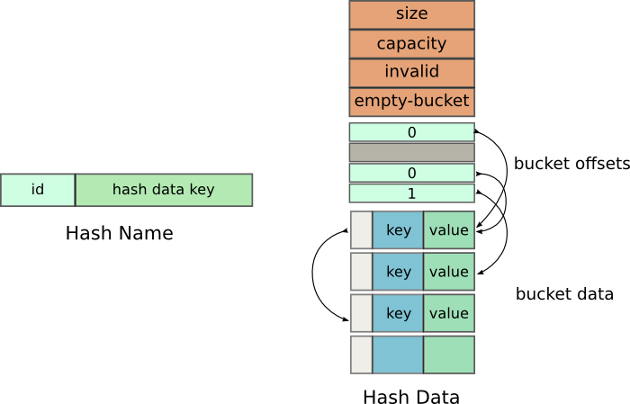
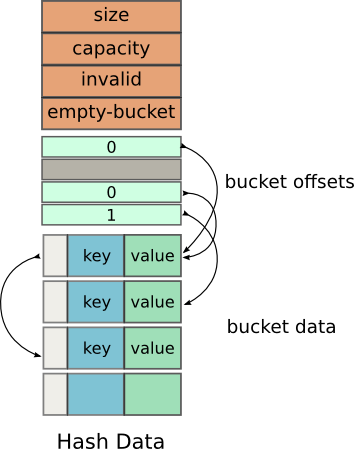

# 共享内存哈希表

最近在学习共享内存区的知识，通过共享内存区的方式实现进程间通讯的效率比网络通讯会高很多，于是想到是不是可以通过共享内存的方式在多个进程间共享缓存呢？比如，可以在运行多个php-fpm `works`的主机上共享配置或者数据，进而大大减少文件IO和内存占用了，一台机器获取可以运行更多的`works`了。

用共享内存区来作为键值对数据的缓存，主要是解决读写、查找和动态扩容缩容的问题了。对于读写、查找删除等问题，我们可以简单的通过哈希表来解决。而对于动态调整共享内存区的话就有些麻烦了。为了简化问题，设想更新共享内存区的进程（就称之为`server`进程吧，用于定期刷新缓存区，读取配置或者数据文件来更新缓存区，并且根据数据大小动态调整共享内存区的大小）只有一个，其好处在于不用考虑写锁的问题。server进程如何动态调整共享内存的大小而不影响其他进程读取数据呢？思前想后觉得开辟一块新的共享内存区来写入数据，然后告诉其他进程，来读取这块新的缓存区吧，旧的已经过时了！

可是问题又来了，如何及时通知其他进程共享内存区变了呢？通知它们必须得及时且高效啊，更重要的是不能影响效率和性能。也许你们也能想到，那就再来一块共享内存区吧，专门用来记录当前最近的共享内存区是哪个。其他进程（暂时称之为client进程吧，虽然感觉不太合理）每次先读取”版本“共享区内存的数据，获悉当前最近版本的共享内存区的名字（[如ftok的返回值](/clang/ipc/system-v-shm.html#shmget-%E5%87%BD%E6%95%B0)），根据名字映射相应的缓存共享内存区，进而读取最近的缓存。

这样问题就有些眉目了，先简单的用`PHP`来实现一下吧！于是新建了一个项目[ShareCache: Cache key-values in share memory for multiple processes to read without read lock](https://github.com/bingbig/ShareCache)，用来缓存配置文件，给多个PHP进程共享配置数据。

## ShareCache


## C 版本
通过C来实现共享缓存（共享内存区数据缓存）的话需要在共享内存区中保存哈希表，因为共享内存区是进程中的映射，在不同的进程中其地址可能不同。也就是说，不能通过malloc等调用来实现内存管理了，哈希表中的所用数据的地址都必须通过相对于内存共享区起始地址的偏移量计算得到。我设想了很多的数据保存和查找方案，都能实现Key-Value的查找插入和删除和动态扩容的机制。偶然间，我发现一篇很好的博客，解决了和我一样的问题，不过人家的方案更加健全和完善，在此贴上来，有时间翻译一下。
> 原网址：[https://vhanda.in/blog/2012/07/shared-memory-hash-table/](https://vhanda.in/blog/2012/07/shared-memory-hash-table/)

### Shared Memory Hash Table
19 Jul 2012

For the last month I’ve been working on a hash table which is stored in shared memory and can thus easily be used across applications. This is ideal for simple caches of data that reside in multiple applications. My specific use case was the Nepomuk Resource class, which is a glorified cache of key value pairs and uses a hash table. A considerable amount of effort has gone into making sure that each application’s Resource classes are consistent with the other applications.

I always thought something this basic would have been implemented, but I just couldn’t find a shared memory hash table which actually supported resizing.

#### Basic Hash Table
Hashing is arguably one of the most important concepts of computer science. If you aren’t aware of how it works here are some nice links -

1. [Wikipedia Article](http://en.wikipedia.org/wiki/Hash_table)
2. [Video lectures from algo-class.org](https://class.coursera.org/algo/lecture/preview)
3. [Video lectures from MIT](Video lectures from MIT)

#### Shared Memory Hash Table
When implementing a hash table in shared memory, one encounters a couple of problems which normal hash tables do not have to deal with. Namely ‘named memory locations’. In the Unix world each shared memory location has to be given a unique identifier so that it can be accessed by other applications. Because of that we cannot allocate each Node/Bucket independently.

Most hash tables, which handle collisions by chaining look like this


Allocating a new named shared memory region for each node seems like quite an overkill.

##### Structure
Since everything has to fit inside a contiguous memory location, we need to structure the hash table a little differently.



We use two shared memory locations - `HashName` and `HashData`. This is done cause a hash table is not fixed in size, and will need to be reallocated. With the reallocations, a new named shared memory will have to be created, and all existing clients would need to be informed to use this newly allocated location which would have a different name.

Instead we use HashName as the unique identifier the client knows about, and HashData is internally used and can be changed when the hash table needs to grow in size.

##### Hash Name data


The additional integer is a micro optimization. Whenever a client needs to use the hash table they need to make sure that they are connected to the appropriate shared memory, and not the old version. The code does that by checking if HashData name is the same as the same as the one provided by HashName.

This results in a string comparison, which would take a certain number of cycles depending on the length of the string. We use an additional integer to indicate the if the string has changed. Integer comparisons are a lot faster than string comparisons.

##### Internal Data



Most of the initial members are quite obvious, but I’m still listing them.
- Size: The number of elements in the hash table
- Capacity: The total number of elements the hash table can hold
- Invalid: The number of buckets that invalid (have been deleted)
- Empty-Bucket: The offset of the next empty bucket which may be used for insertion

After this comes the array of offsets referred internally as m_buckets. This array instead of holding the pointers to the Buckets, like in a traditional hash table, it holds offsets from the beginning of the next array.

The next array is an array of Bucket s, which is internally referred to as m_data. This array holds the key value pairs. A typical Bucket is defined as -
```c
struct Bucket {
    KeyType key;
    ValueType value;
    int hash;
    int link;
}
```
The link member is again not a pointer, but it contains the integer offset to the next Bucket from the start of m_data.

##### Insertions
Insert operations are quite simple. The `key` is hashed into an integer, which after a modulo operation is used as the index.

The corresponding `index` is checked in `m_buckets`. If `m_buckets` does not already have some value over there, there is no collision and we just allocate a new Bucket and plug in its offset.

Allocations of new buckets are done by consuming the location given by emptyBucket, and then incrementing its value.

If `m_buckets` does not have an empty value, we go to the corresponding Bucket, and follow its link until the link is empty. At that point we allocate a new node and make the link point to this new Bucket. This approach is almost identical to that of conventional chaining, except that we are using offsets instead of pointers.

##### Deletions
Delete operations are fairly similar to insertions. The index is procured by hashing they key, and performing a modulo operation with the capacity. After which m_buckets is used to get the offset of the actual Bucket. Instead of deleting the bucket, which would not be possible cause it is stored in an array, we simply mark it as invalid.

The number of invalid buckets is then updated, and m_buckets[index] is marked as empty. Later during the resize operation, the wasted memory will be cleaned up.

Note: Deletions are actually a little more complex because of collisions, but you just need to traverse the entire link chain, and mark the corresponding Bucket as invalid

Resizing
The resize operation occurs when the loadRatio of the hash table goes above a certain threshold. For now, I’ve set it to 0.8.

**loadRatio = (invalid-buckets + size) / capacity**

When the loadRatio goes above 0.8, a new shared memory location is allocated. The metadata (size, capacity, invalid and empty-Bucket) are initially copied to the new shared memory. After which the offset for each bucket is recalculated ( hash % newCapacity ), and it is inserted into the new shared memory.

The invalid buckets are ignored and they are not copied.

Once the copying is completed, the hash data key in HashName is updated, the id is incremented. This is done so that all other applications using the shared memory can update their internal pointers.

##### Iterating
Iterating over the hash table is probably the only operation that is a lot simpler than traditional hash tables. We already have all the data listed as an array -`m_data`. All we need to do is iterate over it while discarding invalid buckets which were created by delete operations.

Well, in theory.

In practice, safely iterating over a shared hash involves copying the element being accessed. Mainly because another application could have shrunk the entire memory and your index could no longer be valid.

Another possible way is to copy its contents to a `QHash`. I’ve implemented a simple function for that.

#### Problems
##### Dynamically allocated Types
You cannot use any types which dynamically allocate memory as the key or value. This rules out QString, QUrl, QVariant (kinda) and most of the commonly used Qt Data Structures. If you need to use a string as the key, you’ll need to explicitly set an upper limit by using something like QVarLengthArray.

This is a huge problem, and makes using the shared hash very difficult in practice.