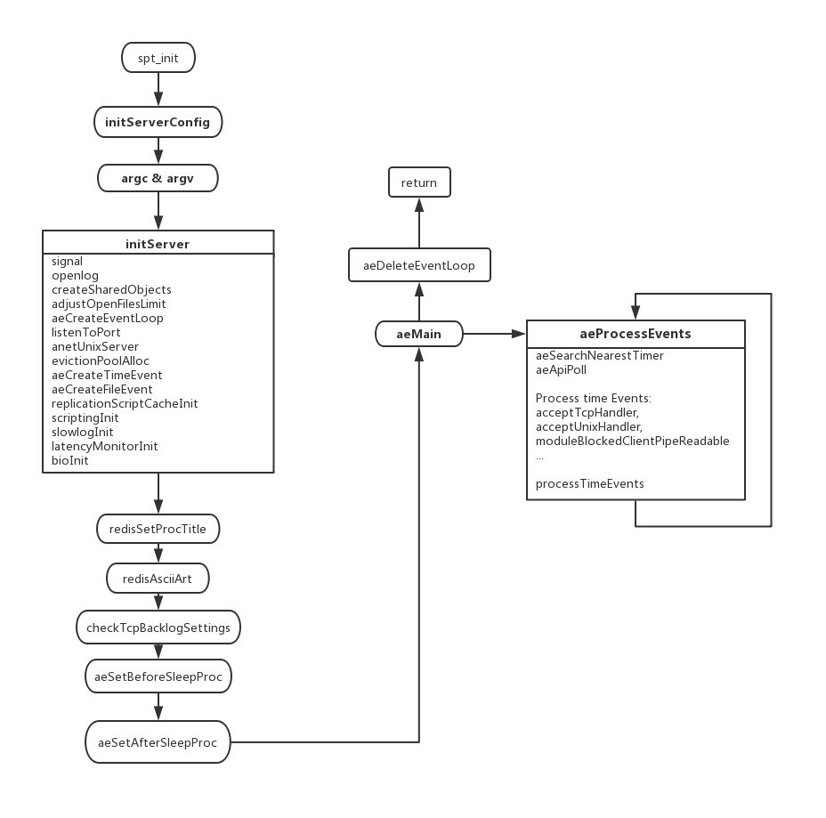

# Redis启动流程
阅读一个C项目，直接从`main`函数入手是一个很不错的选择。通过梳理`redis.c`中的`main`函数逻辑，我们可以很清晰的了解到redis启动过程中主要流程。



上图只简略的列出了主要的函数，下面我们跟着`main`函数一步步学习redis启动的过程。

## `spt_init`

处理进程启动时的参数和环境变量，以便于后期修改进程名。为什么改个程序名要如此大费周折呢，那是因为`agrv`和`environ`是连续存储的。我找了些相关的资料可以查阅：[redis里的小秘密:设置进程名](https://www.jianshu.com/p/36c301ac87df)，[Linux修改进程名称(setproctitle())](https://blog.csdn.net/hengshan/article/details/7835981)。

处理了参数和环境变量后，redis陆续执行了一些系列的修改和定义：`setlocale`（设置地域），`zmalloc_set_oom_handler`(设置内存不足时的操作),`srand`(初始化随机种子), `gettimeofday`, `getRandomHexChars`,`dictSetHashFunctionSeed`等等。之后redis检查执行的可执行文件名是否是`redis-sentinel`或者参数中包含`--sentinel`，如果是的话redis将进入`哨兵模式`，进而转入哨兵模式的执行流程中。本文我们只讨论redis普通节点的启动过程。

## `initServerConfig( )`
这一步主要是在初始化全局的`server`([上一篇](./server.md))对象中的各个数据成员。为下一步解析参数和配置文件做好准备。

## `argc` & `argv`

在这一步中，redis检查传入的各项参数，读取并解析配置文件（`loadServerConfig`）。如果没有配置redis为`supervised`模式，并且指定了后台运行redis时，redis执行进入后台的方法：
```c
if (background) daemonize();
```
redis是如何将自己转变成为守护进程的呢？下面我们展开看看`daemonize()`：
```c
void daemonize(void) {
    int fd;

    if (fork() != 0) exit(0); /* parent exits */
    setsid(); /* create a new session */

    /* Every output goes to /dev/null. If Redis is daemonized but
     * the 'logfile' is set to 'stdout' in the configuration file
     * it will not log at all. */
    if ((fd = open("/dev/null", O_RDWR, 0)) != -1) {
        dup2(fd, STDIN_FILENO);
        dup2(fd, STDOUT_FILENO);
        dup2(fd, STDERR_FILENO);
        if (fd > STDERR_FILENO) close(fd);
    }
}
```
redis先`fork`出一个子进程，并退出父进程，以此断开和终端的交互。`STDIN_FILENO`(STDIN_FILENO = 0)，`STDOUT_FILENO`(STDOUT_FILENO = 1)和`STDERR_FILENO`(STDERR_FILENO = 2)文件句柄分别与标准输入，标准输出，标准错误输出相关联，所以用户应用程序调用`open`函数打开文件时，默认都是以`3`索引为开始句柄。将标准输入，标准输出，标准错误输出都定向（[dup2()](https://linux.die.net/man/2/dup2)）到`fd`对应的`/dev/null`中，然后关闭`fd`。执行完此操作后，后台模式运行的redis继续执行后面的流程。

## `initServer( )`
在这一步中，redis首先对信号做了一些处理：
```c
signal(SIGHUP, SIG_IGN);
signal(SIGPIPE, SIG_IGN);
setupSignalHandlers();
```
- `signal(SIGHUP, SIG_IGN)`  redis多作为守护进程运行，这时其不会有控制终端，首先忽略掉SIGHUP信号。
- `signal(SIGPIPE, SIG_IGN)` TCP是全双工的信道，可以看作两条单工信道， TCP连接两端的两个端点各负责一条。 当对端调用close时， 虽然本意是关闭整个两条信道， 但本端只是收到FIN包。按照TCP协议的语义，表示对端只是关闭了其所负责的那一条单工信道，仍然可以继续接收数据。也就是说，因为TCP协议的限制，一个端点无法获知对端的`socket`是调用了`close`还是`shutdown`。对一个已经收到FIN包的socket调用read方法，如果接收缓冲已空，则返回0，这就是常说的表示连接关闭。但第一次对其调用write方法时，如果发送缓冲没问题，会返回正确写入(发送)。但发送的报文会导致对端发送RST报文，因为对端的socket已经调用了close，完全关闭，既不发送，也不接收数据。所以第二次调用write方法(假设在收到RST之后)，会生成SIGPIPE信号，导致进程退出。**为了避免进程退出, 可以捕获SIGPIPE信号, 或者忽略它, 给它设置SIG_IGN信号处理函数**。

#### `createSharedObjects`
然后redis继续初始化全局的`server`([上一篇](./server.md))对象，并在里面初始化了全局的`shared`对象（`createSharedObjects(void)`）。`createSharedObjects` 这个函数主要是创建一些共享的全局对象。我们平时在跟redis服务交互的时候，如果有遇到错误，会收到一些固定的错误信息或者字符串比如：`-ERR syntax error，-ERR no such key`，这些字符串对象都是在这个函数里面进行初始化的，此外，redis还初始化了`OBJ_SHARED_INTEGERS`（默认为10,000）个整数对象用于共享。

#### `adjustOpenFilesLimit`
该函数主要检查下系统的可允许打开文件句柄数，对于redis来说至少要32(`CONFIG_MIN_RESERVED_FDS`)个文件句柄，如果检测到环境不合适，会去修改环境变量，以适合redis的运行。

#### `aeCreateEventLoop`
```c
server.el = aeCreateEventLoop(server.maxclients+CONFIG_FDSET_INCR);
```
宏`CONFIG_FDSET_INCR`展开是`CONFIG_MIN_RESERVED_FDS+96`，初始化event loop时，redis作者antirez设置`总的描述符数` = server.maxclients + `RESERVED_FDS` + `富余的数目`（保证安全），`RESERVED_FDS` 默认为32。
这个函数很重要，redis的事件对象就是在这个函数里面创建的，包括一些高并发异步机制对象也是在这里面初始化的。

```c
aeEventLoop *aeCreateEventLoop(int setsize) {
    aeEventLoop *eventLoop;
    int i;

    if ((eventLoop = zmalloc(sizeof(*eventLoop))) == NULL) goto err;
    eventLoop->events = zmalloc(sizeof(aeFileEvent)*setsize);
    eventLoop->fired = zmalloc(sizeof(aeFiredEvent)*setsize);
    if (eventLoop->events == NULL || eventLoop->fired == NULL) goto err;
    eventLoop->setsize = setsize;
    eventLoop->lastTime = time(NULL);
    eventLoop->timeEventHead = NULL;
    eventLoop->timeEventNextId = 0;
    eventLoop->stop = 0;
    eventLoop->maxfd = -1;
    eventLoop->beforesleep = NULL;
    eventLoop->aftersleep = NULL;
    if (aeApiCreate(eventLoop) == -1) goto err;
    /* Events with mask == AE_NONE are not set. So let's initialize the
     * vector with it. */
    for (i = 0; i < setsize; i++)
        eventLoop->events[i].mask = AE_NONE;
    return eventLoop;

err:
    if (eventLoop) {
        zfree(eventLoop->events);
        zfree(eventLoop->fired);
        zfree(eventLoop);
    }
    return NULL;
}
```
`aeApiCreate`是作者封装的I/O多路复用函数中的一个。对于异步机制的选择，按性能的高到低的顺序排列可以看到redis是这样一个顺序
`evport -> epoll -> kqueue -> select`。

```c
/* 选择系统最佳的I/O多路复用函数库。按性能的高到低的顺序排列 */
#ifdef HAVE_EVPORT
#include "ae_evport.c" /* Solaris系统内核提供支持的 */
#else
    #ifdef HAVE_EPOLL
    #include "ae_epoll.c" /* LINUX系统内核提供支持的 */
    #else
        #ifdef HAVE_KQUEUE
        #include "ae_kqueue.c" /* Mac 系统提供支持的 */
        #else
        #include "ae_select.c" /* 是POSIX提供的， 一般的操作系统都有支撑 */
        #endif
    #endif
#endif
```

#### `listenToPort`
```c
listenToPort(server.port,server.ipfd,&server.ipfd_count)
```
全局结构体对象`server`的成员`bindaddr`中保存了要绑定和监听的IP（可以是多个），`listenToPort`依次绑定这些IP和`server.port`端口。

#### `anetUnixServer`
这个函数则是启动uinx socket的监听。

#### `evictionPoolAlloc`
初始化`LRU`键池。

#### `aeCreateTimeEvent`
这个函数主要作为定时任务的注册，在这里redis注册了`serverCron()`的定时任务，时间间隔是1毫秒，再执行一次之后就会对时间间隔进行重新设定。

#### `aeCreateFileEvent`
创建文件事件。将之前监听的`TCP socket`和`unix socket`描述符加入到文件事件链表中，而且是只读事件，并分别绑定事件的读操作为`acceptTcpHandler`和`acceptUnixHandler`。当有新的连接到来时，监听描述符的可读，redis会执行`acceptTcpHandler`或`acceptUnixHandler`来接受新的TCP或unix域连接请求。对于TCP连接来说，接受连接并处理请求的流程如下：

```c
acceptTcpHandler() -> anetTcpAccept() -> acceptCommonHandler() -> createClient() -> linkClient()
```

`acceptTcpHandler`调用`anetTcpAccept`（封装了`accept`函数）从已经完成连接的队列头返回一个已完成连接，如果成功继续调用`acceptCommonHandler`方法。`acceptCommonHandler`方法会调用`createClient`方法在server端创建并初始化客户端对象，最后加入到`server.clients`链表表尾后。下面列出了客户端对象初始化的部分代码。

```c {8,9,13-20,23, 32}
client *createClient(int fd) {
    client *c = zmalloc(sizeof(client));

    /* 
     * 在其他上下文环境下执行命令时（比如通过Lua脚本），我们需要一个非连接的客户端，可以通过传入-1作为描述符来创建。
     */
    if (fd != -1) {
        anetNonBlock(NULL,fd); /* 设置描述符为非阻塞 */
        anetEnableTcpNoDelay(NULL,fd);  /* 设置描述符为非延迟TCP */
        if (server.tcpkeepalive)
            anetKeepAlive(NULL,fd,server.tcpkeepalive);

        /* 为客户端创建可读文件事件，并传入可读时的操作readQueryFromClient */
        if (aeCreateFileEvent(server.el,fd,AE_READABLE,
            readQueryFromClient, c) == AE_ERR)
        {
            close(fd);
            zfree(c);
            return NULL;
        }
    }

    selectDb(c,0); /* 默认选择第0个数据库 */
    uint64_t client_id;
    atomicGetIncr(server.next_client_id,client_id,1);
    c->id = client_id;
    c->fd = fd;
    c->name = NULL;
    
    ...

    if (fd != -1) linkClient(c);
    initClientMultiState(c); /* 为客户端执行MULTI/EXEC命令做初始化 */
    return c;
}
```
在初始化客户端对象时，redis为这个客户端创建了相应的可读文件事件，并指定了描述符可读时的操作`readQueryFromClient`。当服务端接收到来自客户端的数据时，继而该已连接描述符可读，redis调用`readQueryFromClient`读取客户端发来的命令并执行相应的操作。

在创建初始的文件和时间事件后，redis继续后面的初始化：

#### `replicationScriptCacheInit`
#### `scriptingInit`
#### `slowlogInit`
#### `latencyMonitorInit`
#### `bioInit`
后台I/O服务初始化。创建3个功能互不影响的线程，每个线程都有一个工作队列。主线程生产任务放到任务队里，这三个线程消费这些任务。任务队列和取出消费的时候都得加锁，防止竞争，使用条件变量来等待任务以及通知。

## `aeMain`
在执行完`initServer()`之后，redis时初始化进入尾声，但仍需要完成一些其他的工作：
```c
createPidFile() -> redisSetProcTitle(argv[0]) -> redisAsciiArt() -> checkTcpBacklogSettings() -> ...
aeSetBeforeSleepProc() -> aeSetAfterSleepProc() -> aeMain()
```
最终到达redis的核心`aeMain()`函数，进入时间循环主函数，永不退出，除非服务被终止。函数代码如下：
```c
void aeMain(aeEventLoop *eventLoop) {
    eventLoop->stop = 0;
    while (!eventLoop->stop) {
        if (eventLoop->beforesleep != NULL)
            eventLoop->beforesleep(eventLoop);
        aeProcessEvents(eventLoop, AE_ALL_EVENTS|AE_CALL_AFTER_SLEEP);
    }
}
```
`aeMain()`循环调用`aeProcessEvents()`来不停的处理事件（时间事件和文件事件）。那么，redis是如何高效快速处理这两种事件的呢？这就要好好读一读`aeProcessEvents`（[下一篇](./aeProcessEvents.md)）的实现了。

## 参考资料
- [redis启动流程（一）](http://www.ituring.com.cn/article/265187)
- [redis启动流程（二）](http://www.ituring.com.cn/article/196415)
- [redis里的小秘密:设置进程名](https://www.jianshu.com/p/36c301ac87df)
- [Linux修改进程名称(setproctitle())](https://blog.csdn.net/hengshan/article/details/7835981)
- [dup2()](https://linux.die.net/man/2/dup2)
- [redis的多线程](https://www.cnblogs.com/ztteng/p/9773444.html)


